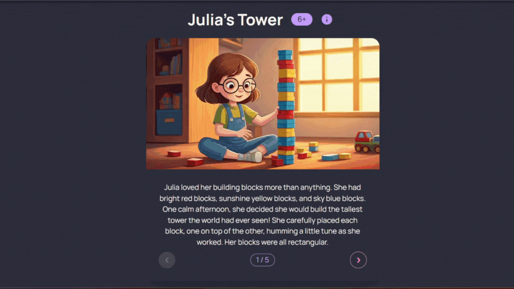

# Kidlytics: AI-Powered Story Generator for Kids



Kidlytics is a web application that leverages the power of Google Cloud's Vertex AI to generate engaging and personalized stories for children. By answering a series of fun questions, parents and educators can create unique, illustrated stories tailored to a child's interests and learning goals, all orchestrated by the Genkit framework.

## Table of Contents

- [Kidlytics: AI-Powered Story Generator for Kids](#kidlytics-ai-powered-story-generator-for-kids)
  - [Table of Contents](#table-of-contents)
  - [Technologies Used](#technologies-used)
  - [Getting Started](#getting-started)
    - [Prerequisites](#prerequisites)
    - [1. Clone the Repository](#1-clone-the-repository)
    - [2. Install Dependencies](#2-install-dependencies)
    - [3. Set Up Google Cloud \& Firebase](#3-set-up-google-cloud--firebase)
    - [4. Configure Environment Variables](#4-configure-environment-variables)
      - [4.1. Angular Application (Root)](#41-angular-application-root)
      - [4.2. Firebase Functions (`/functions`)](#42-firebase-functions-functions)
    - [5. Deploy Firebase Functions](#5-deploy-firebase-functions)
    - [6. Run the Application](#6-run-the-application)
  - [Firebase Functions](#firebase-functions)
  - [Project Structure](#project-structure)
  - [How It Works](#how-it-works)
  - [Contributing](#contributing)

## Technologies Used

- **Frontend:**

  - [Angular](https://angular.io/): A powerful framework for building dynamic single-page applications.
  - [Tailwind CSS](https://tailwindcss.com/): A utility-first CSS framework for rapid UI development.
  - [Angular Material](https://material.angular.io/): A UI component library for Angular.

- **Backend & AI:**

  - [Node.js](https://nodejs.org/en) with [Express](https://expressjs.com/): For the server-side logic and API endpoints.
  - [**Google Cloud Vertex AI**](https://cloud.google.com/vertex-ai): The core platform for hosting and running generative AI models (like Gemini for text and Imagen for images).
  - [**Genkit**](https://firebase.google.com/docs/genkit): An open-source framework from Google for building, deploying, and monitoring AI-powered applications.
  - [**Firebase Firestore**](https://firebase.google.com/docs/firestore): A NoSQL database for storing the generated stories.
  - [**Firebase Functions**](https://firebase.google.com/docs/functions): For serverless backend logic, such as rate limiting.

- **Development & Authentication:**
  - [Angular CLI](https://angular.io/cli): For managing the Angular project.
  - [TypeScript](https://www.typescriptlang.org/): For type-safe JavaScript development.
  - [**Google Cloud SDK (gcloud)**](https://cloud.google.com/sdk): For authenticating the local development environment with your Google Cloud project.

## Getting Started

Follow these steps to get a local copy of the project up and running on your machine.

### Prerequisites

- [Node.js](https://nodejs.org/en/download/) (v20.x or higher)
- [Angular CLI](https://angular.io/cli)
- [Firebase CLI](https://firebase.google.com/docs/cli#install)
- A [Google Cloud](https://cloud.google.com/) account with an active billing account.
- The [Google Cloud SDK (`gcloud` CLI)](https://cloud.google.com/sdk/docs/install) installed and configured on your machine.

Before you begin, make sure you are logged into the Firebase CLI:
```bash
firebase login
```

### 1. Clone the Repository

```bash
git clone https://github.com/your-username/kidlytics.git
cd kidlytics
```

### 2. Install Dependencies

Install the necessary npm packages for both the root project and the functions directory in a single step:

```bash
npm install && (cd functions && npm install)
```

### 3. Set Up Google Cloud & Firebase

This project uses Google Cloud for AI services and Firebase for the database and serverless functions.

1.  **Create a Google Cloud Project:**

    - Go to the [Google Cloud Console](https://console.cloud.google.com/projectcreate) and create a new project.
    - Make a note of the **Project ID**.

2.  **Enable Required APIs:**

    - For your new project, you must enable the Vertex AI API.
    - Visit the [Vertex AI API Library page](https://console.cloud.google.com/apis/library/vertexai.googleapis.com) and click **Enable**.

3.  **Authenticate via `gcloud` CLI:**

    - This is a crucial step that allows Genkit to securely access your Google Cloud resources without needing to manage API keys in your code.
    - Run the following command in your terminal and follow the prompts to log in with your Google account:
      ```bash
      gcloud auth application-default login
      ```
    - Set your active project to the one you just created. This ensures all subsequent `gcloud` and SDK commands target the correct project.
      ```bash
      gcloud config set project YOUR_PROJECT_ID
      ```
      (Replace `YOUR_PROJECT_ID` with the ID from step 1).

4.  **Set Up Firebase:**
    - Go to the [Firebase Console](https://console.firebase.google.com/) and click "**Add project**".
    - Select your existing Google Cloud Project to link Firebase to it.
    - From your project's dashboard, create a new **Web app** (the `</>` icon).
    - You will be provided with a `firebaseConfig` object. Copy these keys for the next step.
    - Navigate to the **Firestore Database** section and create a new database. Start in **test mode** for easy setup (you can configure security rules later).

### 4. Configure Environment Variables

This project requires two separate `.env` files: one for the Angular application and one for the Firebase Functions.

#### 4.1. Angular Application (Root)

The Angular app uses a script to generate its environment files from a `.env` file in the root of the project.

1.  **Create a `.env` file** in the root of the project.

2.  **Add your configuration keys** to the `.env` file. This file should include your Firebase project details and your Google Cloud Project ID.

    ```env
    # Firebase Configuration
    API_KEY="YOUR_FIREBASE_API_KEY"
    AUTH_DOMAIN="YOUR_FIREBASE_AUTH_DOMAIN"
    PROJECT_ID="YOUR_FIREBASE_PROJECT_ID"
    STORAGE_BUCKET="YOUR_FIREBASE_STORAGE_BUCKET"
    MESSAGING_SENDER_ID="YOUR_FIREBASE_MESSAGING_SENDER_ID"
    APP_ID="YOUR_FIREBASE_APP_ID"

    # Google Cloud Configuration
    GCP_PROJECT_ID="YOUR_GCP_PROJECT_ID" # Should be the same as PROJECT_ID

    # Application Settings
    STORY_GENERATION_LIMIT=3
    enableStoryGenerationLimit=true
    ADMIN_PASSWORD="your_secret_password"
    ```

3.  **Run the script** to generate the `environment.ts` and `environment.development.ts` files:
    ```bash
    npm run generate:env
    ```
This command will read your `.env` file and create the necessary configuration for the Angular application.

#### 4.2. Firebase Functions (`/functions`)

The `functions` directory contains serverless functions that require their own environment variables.

1.  **Navigate to the `functions` directory**.
2.  **Create a `.env` file** inside the `functions` directory.
3.  **Add the application settings** to this `functions/.env` file. You can copy them from the root `.env` file.
    ```env
    # Application Settings
    STORY_GENERATION_LIMIT=3
    enableStoryGenerationLimit=true
    ADMIN_PASSWORD="your_secret_password"
    ```

### 5. Deploy Firebase Functions

Before running the application, you need to build and deploy the Firebase Functions.

```bash
# Make sure you are in the functions directory
cd functions
npm run build
firebase deploy --only functions
```

For a production environment, it is recommended to set the environment variables directly in the Google Cloud console instead of using a `.env` file.

### 6. Run the Application

Now you can start the Angular development server.

```bash
# In one terminal, run the Angular dev server
npm start
```

Open your browser and navigate to `http://localhost:4200/`.

## Firebase Functions

This project uses two Firebase Functions located in the `functions` directory:

- **`rateLimiter`**: This function tracks the number of stories generated by a user (based on their IP address) to enforce the generation limit.
- **`validatePasswordAndOverride`**: This function allows a user with the correct admin password to bypass the rate limit.

These functions are called by the Angular application to control access to the story generation feature.

## Project Structure

Here is an overview of the key files and directories in the project:

```
.
├── src/
│   ├── app/
│   │   ├── components/       # Reusable UI components
│   │   ├── services/         # Services for API calls (generate-story.ts)
│   │   ├── model/            # TypeScript types and interfaces
│   │   └── ...
│   ├── constants/          # Application constants (e.g., questions.ts)
│   ├── genkit/             # Genkit AI flow definitions (storyGenerationFlow.ts)
│   ├── environments/       # Environment configuration files
│   ├── server.ts           # Express server for handling API requests and Genkit flows
│   └── ...
├── functions/              # Firebase Functions for rate limiting
│   ├── index.ts
│   ├── package.json
│   └── .env                # (You need to create this)
├── angular.json            # Angular project configuration
├── package.json            # Project dependencies and scripts
└── ...
```

## How It Works

1.  **User Input**: The user answers a series of questions within the Angular app.
2.  **Rate Limiting**: Before generating a story, the app calls the `rateLimiter` Firebase Function to check if the user has reached their limit.
3.  **API Call**: If allowed, the frontend sends the answers to the backend Express server.
4.  **Genkit Orchestration**: The server triggers the `storyGenerationFlow`.
5.  **AI Story and Image Generation**: This flow calls the **Gemini model on Vertex AI** to generate the story text and then uses the **Imagen model on Vertex AI** to create illustrations for each part of the story.
6.  **Storing the Story**: The complete story, including the text and image data, is saved to Firebase Firestore.
7.  **Displaying the Story**: The user is given a link to a page where they can view the newly generated story with its illustrations.

## Contributing

Contributions are welcome! If you have ideas for new features or improvements, please feel free to open an issue or submit a pull request.

1.  Fork the Project
2.  Create your Feature Branch (`git checkout -b feature/AmazingFeature`)
3.  Commit your Changes (`git commit -m 'Add some AmazingFeature'`)
4.  Push to the Branch (`git push origin feature/AmazingFeature`)
5.  Open a Pull Request
